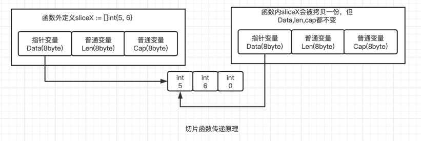

## 常用结构

### slice

#### 什么是切片

切片是一个24byte的结构体，源码`reflect/value.go`中的定义如下：

```Go
type SliceHeader struct {
	Data uintptr
	Len  int
	Cap  int
}
```

不难看出切片这个结构体就三个字段，len表示长度，cap表示容量，data表示具体的数据(data是个指针哦)。

使用`unsafe.sizeof()`打印某个切片始终是24字节=8byte+8byte+8byte。而数组使用`unsafe.sizeof()`结果会根据数组的长度不同而不同。

**slice的函数传递发生的是浅拷贝，只会对slice结构体进行一次值拷贝。但是slice的读写是和指针的读写类似，通过一个指针变量Data去修改具体的数据，从而达到函数内外相互影响的作用。**

**不止是函数传递，包括slice的复制，同样也是只拷贝slice的结构体，共用底层的数据，所以复制出来的切片修改数据也会影响到原值。**



#### 定义切片

