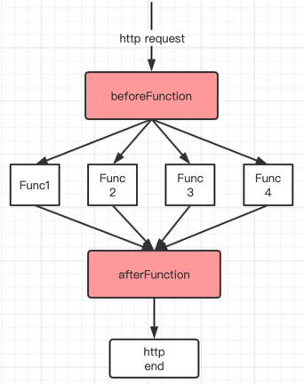
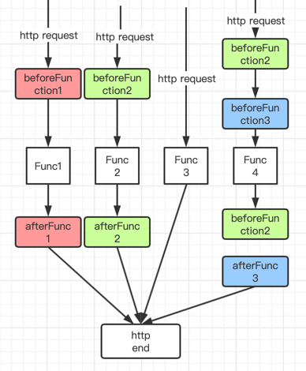
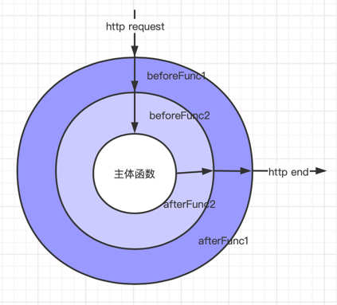

## 什么是中间件

> 中间件是一个十分宽泛的概念，在不同领域表示不同的含义，其中在bs/cs软件编程框架中，中间件可以理解为一些用于解耦业务和非业务代码的钩子函数，这些函数可以适用于所有或者部分请求。

中间件的原理和`钩子函数`类似，在框架层面，程序运行到某个阶段自动执行预设值的函数，运行完后再回到跳出的那个阶段继续执行原函数。

在bs/cs开发中，为了在主体函数前后执行一些通用操作，常见的写法会预设一些钩子比如`beforeXxxFunc` `afterXxxFunc`，但这毕竟只有两个函数并且是针对全局请求，想要实现部分钩子函数针对某些请求就得做一些额外的业务外的操作来达到目的。gin框架的中间件就解决了这些痛点。

## 中间件原理

> 原理1：每一条请求就是处理自己所挂载的所有中间件和唯一主体函数。

普通的钩子函数如图所示：



优点：

解耦了业务和非业务代码，非业务代码做到了统一封装使用。

缺点：

如果想针对某些主体函数不执行或者执行其他`beforeFunction`需要额外修改框架逻辑。

gin框架中间件如图：



优点：

- 利用中间件解耦了业务和非业务代码
- 每个中间件可以复用
- 每个主体函数也可以单独设置一个或者多个中间件

> 原理2：洋葱模型

洋葱模型，如图所示：



beforeFunc1和afterFunc1即是中间件1

afterFunc2和afterFunc2即是中间件2


请求到来时从最外层开始执行中间件1，然后进入第二层，依次执行完所有中间件最后到达主体函数，接着再一层一层的往外走再次执行中间件2...中间件1...最后返回，也有点像栈的概念。


## gin中中间件的实现

### 步骤1

首先，gin把中间件和主体函数统一定义为一个`handleFunc`

源码：`gin.go`

```Go
// HandlerFunc defines the handler used by gin middleware as return value.
type HandlerFunc func(*Context)

//注册中间件
func (engine *Engine) Use(middleware ...HandlerFunc) IRoutes {
	engine.RouterGroup.Use(middleware...)
	engine.rebuild404Handlers()
	engine.rebuild405Handlers()
	return engine
}
```

不管是用`use()`方法注册中间件，还是用restful注册主体函数，类型都是`HandlerFunc`。

源码：`routergroup.go`

```Go
// POST is a shortcut for router.Handle("POST", path, handle).
func (group *RouterGroup) POST(relativePath string, handlers ...HandlerFunc) IRoutes {
	return group.handle(http.MethodPost, relativePath, handlers)
}

<!--GET/PUT/DELETE同理-->
...
```

### 步骤2

把所有`handleFunc`装入一个数组或者叫`handleChain`的东西

### 步骤3

从`handleChain`的第一个元素开始执行，中间使用`c.next` `c.Abort`等函数来进行流程控制。

## 手动实现一个简单版本的中间件

```Go
package main

import (
	"fmt"
	"math"
)

const maxIndex = math.MaxInt8 / 2

type myFuncHandle func(ctx *myContext)
type myContext struct{
	handleChains []myFuncHandle
	index        int8
}

func (m *myContext) next(){
	if m.index < maxIndex{
		m.index++
		m.handleChains[m.index](m)
	}
}

func (m *myContext) abort(){
	m.index = maxIndex
	fmt.Println("已被终止...")
}

func (m *myContext) use(f myFuncHandle){
	m.handleChains = append(m.handleChains, f)
}

func (m *myContext) get(uri string, f myFuncHandle){
	m.handleChains = append(m.handleChains, f)
}

func (m *myContext) run(){
	m.handleChains[0](m)
}

func main(){
	ctx := &myContext{}
	ctx.use(m1)
	ctx.use(m2)
	ctx.get("hahahah", mainFunc)
	ctx.run()
}

func m1(ctx *myContext){
	fmt.Println("im m1 begin")
	//ctx.abort()
	ctx.next()
	fmt.Println("im m1 end")
}

func m2(ctx *myContext){
	fmt.Println("im m2 begin")
	ctx.next()
	fmt.Println("im m2 end")
}

func mainFunc(ctx *myContext){
	fmt.Println("im get function")
}


```

运行结果：

```text
im m1 begin
im m2 begin
im get function
im m2 end
im m1 end
```


