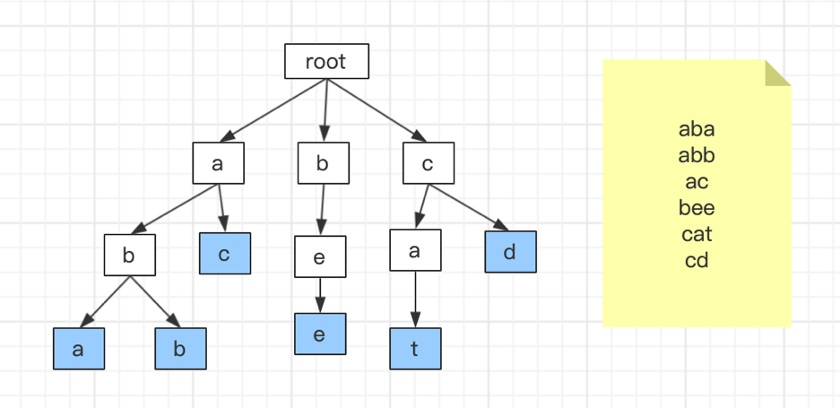
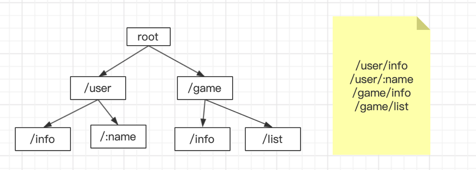

## 什么是http路由

撸过http框架的同学都知道，一个MVC模型的http框架肯定是少不了路由这一块的，那么什么是路由呢。

> 简而言之，http路由即是一条http请求的“向导”，根据URI上的路径，指引该条请求到对应的方法里去执行然后返回，中间可能会执行一些中间件。

## 路由的种类

- 静态路由

框架/用户提前生成一个路由表，一般是map结构，key为URI上的path，value为代码执行点。

优点：只需要读取map，没有任何开销，速度奇快。

缺点：无法正则匹配路由，只能一一对应，模糊匹配的场景无法使用。

- 动态路由

用户定义好路由匹配规则，框架匹配路由时，根据规则动态去规划路由。

优点：适应性强，解决了静态路由的缺点。

缺点：相比静态路由有开销，具体视算法和路由匹配规则而定。

## gin框架路由实现原理

gin框架作为一个轻量级的快速框架，采用的是前缀树的方式实现的动态路由。

### gin框架使用路由

我们以下面代码为例，去看看gin是如何实现路由的。

```Go
r := gin.New()
r.GET("/user/:name", routeUser)

func routeUser(c *gin.Context){
    //todo something
}
```

上面定义了一个路由`/user/:name`会精确匹配`/user/:name`而不会匹配`/user`或者`/user/`或者`/user/allen/abc`

接下来我们跟着源码去探究gin是如何实现的。

### 初始化框架

`r := gin.New()`生成了一个`Engine`对象，`Engine`对象是整个框架的核心，也包含了对路由的操作和许多成员变量，其中包括路由要执行的任务链`Handlers HandlersChain`，方法树`trees            methodTrees`等。

### 定义路由

`r.GET("/user/:name", routeUser)`定义一个`GET`请求，模糊匹配`/user/:name`。

步骤1：

源码：`routergroup.go=>group.calculateAbsolutePath()`

将相对路径`/user/:name`join为绝对路径，因为有可能是个路由组，前面还有一些路径，路由组稍后再介绍。

步骤2：

源码：`routergroup.go=>group.combineHandlers()`

判断`handlersChain`的长度，不能超过`math.MaxInt8 / 2`并且把路由方法装载到`handlersChain`里面去。

步骤3：

源码：`routergroup.go=>group.engine.addRoute()`

装入路由存入`engine.trees`变量。

步骤4：

返回当前对象，达到能使用链式操作的目的。

### 访问路由

输入`localhost:8080/user/abc`，首先进入net的`ServeHTTP()`方法。然后被gin框架`handleHTTPRequest()`方法接受。循环之前注册的路由树`engine.tress`。

匹配methd部分源码`gin.go=>handleHTTPRequest()`：

```Go
t := engine.trees
for i, tl := 0, len(t); i < tl; i++ {
	if t[i].method != httpMethod {
		continue    //判断请求method是否相等如果不等则continue
	}
	root := t[i].root
	// Find route in tree
	value := root.getValue(rPath, c.params, unescape)
	//匹配路由的核心算法，如果匹配出来的value为空则直接退出。
	...
	...
```

匹配路由核心算法源码`tree.go=>getValue()`：

```Go
func (n *node) getValue(path string, params *Params, unescape bool) (value nodeValue) {
walk: // Outer loop for walking the tree
	for {
		prefix := n.path
		if len(path) > len(prefix) {
			if path[:len(prefix)] == prefix {
				//前缀匹配
			    ...
			    
			    switch n.nType {
				case param:
				...
				(*value.params)[i] = Param{
					Key:   n.path[1:],
					Value: val,
				}// 匹配出参数
			}
		}
		if path == prefix {
		    // 完全匹配，无需匹配参数
		    ...
		}

```

### 前缀树算法

前缀树的本质就是一棵查找树，有别与普通查找树，他适用于一些特殊场合，比如用于字符串的查找。比如一个在路由的场景中，有1W个路由字符串，每个字符串长度不等，我们可以使用数组来储存，查找的时间复杂度是O(n)，可以用map来储存，查找的复杂度是O(1)，但是都没法解决动态匹配的问题，如果用前缀树时间复杂度是O(logn)，也可以解决动态匹配参数的问题。

下图展示了前缀树的原理，有以下6个字符串，如果要查找`cat`字符串，步骤如下：

1，先拿字符`c`和`root`的第一个节点`a`比较，如果不等，再继续和父节点`root`的第二个节点比较，直到找到`c`。

2，再拿字符`a`和父节点`c`的第一个节点`a`比较，结果相等，则继续往下。

3，再拿字符`t`和父节点`a`的第一个节点`t`比较，结果相等，则完成。




同理，在路由中，前缀树可以规划成如下：

具体查找方法和上面一致。


