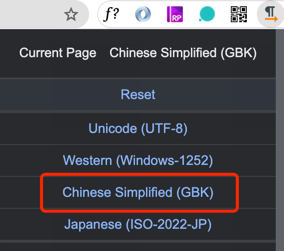

## 编码规则

### bit&byte
在计算机中所有信息都是以二进制位`0`和`1`来存储的。8个bit位是一个字节，计算机对数据的读取是按照一个字节的大小来读取识别的，那么面对全世界这么多语言，计算机是如何知道当前字节表示的是什么意思呢？
今天就来了解下字符在计算机中的编码方式，其中会涉及到`ASCII` `unicode` `UTF-8`等。


### ASCII

首先看下wiki对它的定义：
> ASCII abbreviated from American Standard Code for Information Interchange, is a character encoding standard for electronic communication. ASCII codes represent text in computers, telecommunications equipment, and other devices. Most modern character-encoding schemes are based on ASCII, although they support many additional characters.

大概就是说ASCII是`美国信息交换标准代码`，用来表示电脑和其他电信设备的文本。大家都知道电脑所有信息都是以二进制的方式来计算和存储的，那么人们能识别的文字和计算机中的二进制必然存在一种映射关系，ASCII就是最初的一种映射关系，也叫字符集。

比如在ASCII中，大写字母`A`对应的ASCII码是`65`二进制就是`01000001`；阿拉伯数字`0`对应的ASCII码是`48`二进制就是`110000`；还有些空格`32`；回车`13`等等一些键盘上所见的符号。

ASCII起初只规定了127个字符，就能代表了所有键盘上的普通符号、阿拉伯数字和英文字母，对于英文国家来说能满足日常使用，所以他们把每个字节的第一位置位0，只需要使用后面7位就足够了。

但是其他欧洲国家比如法语、葡萄牙语等无法用127个字符表示完全，所以他们就把第一个空闲0使用了起来。因此欧洲国家用一个字节(8位可表示256个字符)也能实现。

我们回顾一下，ASCII表示的范围：


### unicode
随着计算机在全球的发展和普及开来，其他语言，比如中文、日文，单字节256个字符肯定完全没法表示。所以就出现了一个全球统一的编码规则叫`unicode`，它的作用是把各个语言的字符映射为二进制和ASCII的目的一样。

unicode当前默认的版本是`UCS-2`也就是用定长2个字节来表示字符，6w+的字符量已经足以用于全球的主要语言的大多数字符。但是unicode还是提供了一个扩展机制，允许表示一百多万个字符。

比如英文字母`A`对应的unicode是`U+0041`，转换为十进制是`65`转换为二进制是`0100 0001`和ASCII码一致，只需要一个字节表示。

比如汉字`中`对应的unicode是`U+4e00`转换为十进制是`19968`转换为二进制是`100 1110 0000 0000`，这个二进制有15位，需要至少2个字节表示。

[点击](http://www.chi2ko.com/tool/CJK.htm) 查看中文的unicode编码。

所以这就出现了一个问题，计算机按照字节来读取数据时，如何知道当前字节就是要表示一个字符还是连续的两个字节表示一个字符？
如果按照`unicode`的方式统一用两个字节表示一个字符，那英文字符(只需要一个字节表示，前面全部填充0)的第一字节全是0，对于存储空间是极大的浪费。

### UTF-8
为了解决**如何来表示unicode**这一问题，或者叫**如何让计算机读懂unicode**这一问题，就诞生了UTF-8。它的特点是变长编码，可以使用1-4个字节表示一个字符(unicode)。

UTF-8的规则很简单，就是使用控制码+字符码组成，控制码就是告诉计算机当前是单字节还是多字节，字符码就是对应的`unicode`。

规则1：对于单字节的字符，8个bit位中高位必须等于`0`，这完全等同于127位最初的`ASCII`码。比如大写字母`A`，对于的二进制为`01000001`

规则2：对于需要n个字节的字符：

```text
- 第一个字节:
    - 高位前n位为`1`
    - 第n+1位为`0`
- 其他字节：
    - 高位以`10`开头
- 未提及的位使用对应的unicode补充，不足的在高位用0补充
```

unicode和utf-8的映射关系如下：

|unicode的字符集范围(十六进制)|utf-8的编码方式(二进制)|说明|
|---|---|---|
|0000 0000 ~ 0000 007F | 0xxxxxxx|完全兼容ASCII|
|0000 0080 ~ 0000 07FF | 110xxxxx 10xxxxxx|110表示需要两个字节(当前字节和随后的一个字节)表示当前字符，<br>x为字符的unicode二进制</br>|
|0000 0800 ~ 0000 FFFF | 1110xxxx 10xxxxxx 10xxxxxx|1110表示需要三个字节。。。同上|
|0001 0000 ~ 0010 FFFF | 11110xxx 10xxxxxx 10xxxxxx 10xxxxxx|表示需要四个字节。。。同上|

#### 举例1-ASCII

unicode直接兼容了初期ASCII，所以ASCII的字符，无论是ASCII编码还是utf-8编码，都一样。

#### 举例2-中文

以中文`一`来说，`一`对应的unicode字符集是`4e00`，`4e00`在`0800 ~ FFFF`的范围，所以对应的utf-8为三字节。
`4e00`对应的二进制为`100 1110 0000 0000`，所以utf-8为`11100100 10111000 10000000`，第一个字节的第二个`0`为补充。

附上代码打印`一`对应的编码：

```Go
var yi = "一"
log.Printf("bytes:%v, rune:%v", []byte(yi), []rune(yi))//bytes:[228 184 128], rune:[19968]
//其中golang里面，[]byte表示字符的utf-8编码对应的十进制，[]rune表示字符的unicode对应的十进制。
```

### UTF-16、UTF-32等

上面介绍了文字字符映射为unicode字符集，并且由utf-8来实现编码(如何读取unicode字符集)。其中不止utf-8还有其他编码方式，比如utf-16,utf-32等。

这里简单介绍下这几种编码方式的区别。

|编码类型|字节长度|说明|
|---|---|---|
|utf-8|1-4|由1-4个字节变长|
|utf-16|2-4|2或4字节变长，大部分是2字节，对于ASCII空间浪费|
|utf-32|4|4字节表示，空间极大浪费|


### GB2312、GBK等其他编码

在unicode诞生(1990年开始研发)之前，由于ASCII表示的范围有限，各个国家便着手自己国家语言的编码，比如中国1980年发行了gb2312以及后面出现它的扩展版本GBK。

gb2312因为只表示普通数字、字母、汉字，不表示其他语言，所以使用两个字节已经足够，但是它和汉字的映射与unicode和汉字的映射没有任何关系。

比如汉字`一`在unicode中对应的字符集是`4e00`，而在gb2312中对应的字符集是`D2BB`。

### 为什么会乱码

知道了编码的原理后自然能想到的就是文本编码和解码所使用的字符集不同。

来做一个小实验并且验证下。

新建一个html输入：

```html
<!DOCTYPE html>
<html>
<head>
    <meta charset="utf-8">
    <title></title>
</head>
<body>
123abc一二三
</body>
</html>
```

浏览器打开后显示正常，然后我们使用chrome的charset插件来修改当前页面解码的字符集，这里修改为GBK：



修改后显示结果如下：


数字和字母都未乱码，说明unicode和GBK都向下兼容了ASCII，而汉字`一二三`乱码了，我们来查出这几个字对应的utf-8和gbk编码。

|汉字|unicode字符集|utf-8编码结果|
|---|---|---|
|一|4e00|E4 B8 80|
|二|4E8C|E4 BA 8C|
|三|4E09|E4 B8 89|

|汉字|gbk字符集|为什么会乱码成这个字符？|
|---|---|---|
|涓|E4B8|gbk是按照2个字节解码的，所以读取到E4B8就翻译为了它对应的字符'涓'|
|€|80|接着E4B8后面继续读取两个字节80E4，但是在gbk的字符集里面没有80E4，就只能识别一个字符80对应的字符'€'|
|浜|E4BA|接着80后面继续读取两个字节E4BA，翻译为'浜'|
|屼|8CE4|同上|

### 总结

字符集即是文字符号和二进制的一种映射关系。

128位ASCII码是数字、英文字母、普通符号的字符集。256位ASCII扩展码是ASCII+欧洲部分语言字母的字符集。

GB2312/GBK是ASCII+汉字的字符集，同理还有其他国家的特有字符集。

unicode是ASCII+全球绝大部分字符的字符集。为了节省空间，一般不直接使用unicode，而是将它以utf-8的方式来编码解码使用。

### 引用

ascii wiki[https://zh.wikipedia.org/wiki/ASCII](https://zh.wikipedia.org/wiki/ASCII)

unicode=>汉字编码表[http://www.chi2ko.com/tool/CJK.htm](http://www.chi2ko.com/tool/CJK.htm)

字符集在线翻译[http://www.mytju.com/classcode/tools/encode_utf8.asp](http://www.mytju.com/classcode/tools/encode_utf8.asp)

字符编码笔记[https://www.ruanyifeng.com/blog/2007/10/ascii_unicode_and_utf-8.html](https://www.ruanyifeng.com/blog/2007/10/ascii_unicode_and_utf-8.html)