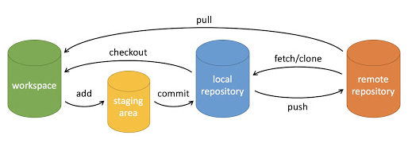
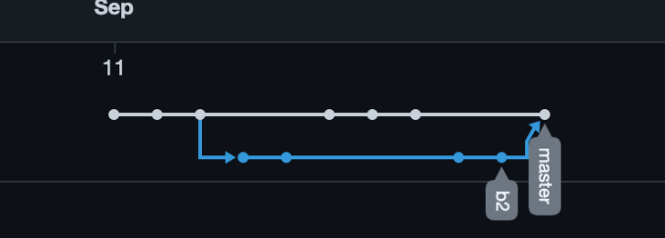
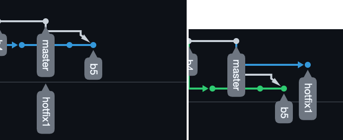
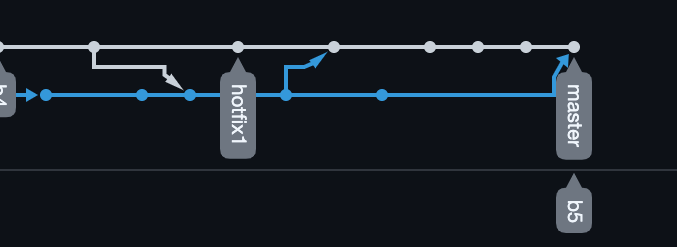

# git命令

## git基本介绍



- workspace: 工作区
- staging area: 暂存区
- local repository：本地仓库
- remote repository：远程仓库

## git基本命令

### 配置

```shell
# 查看当前电脑的git配置情况
$git config -l

# 查看全局的配置文件(修改全局生效)
$git config -e --global
# 查看当前项目的配置文件(修改当前项目生效)
$git config -e
#或者
$vi .git/config

# 设置提交代码时的用户信息
$git config [--global] user.name "username"
$git config [--global] user.email "email address"

# 如果想让某个项目指定推送账号，则在对应项目设置对应账号的用户信息即可。
```

### 查看

``` shell
# 查看变更状态
$ git status

# 查看提交历史(所有人)
$ git log

# 查看工作区和暂存区的diff
$ git diff

# 查看文件具体每一行的最新修改者和时间
$ git blame [fileName]
```

### 增加/删除文件
```shell
# 添加文件到暂存区
$git add [file]

# 添加当前目录所有文件到暂存区
$git add . 

# 从暂存区恢复文件为unstage状态
$ git rm --cached [file]

# 删除文件，并将此次删除提交到暂存区
$ git rm [file]
```

### 提交

```shell
# 从暂存区提交到本地仓库，并附带提交信息
$ git commit -m "message"

# 直接从工作区提交到本地仓库，此操作只针对**修改**有效，**新增文件**无效
$ git commit -a

```

### 分支

```shell
# 列出本地所有分支
$ git branch

# 列出远程所有分支
$ git branch -r

# 列出本地和远程所有分支
$ git branch -a

# 创建分支(基于当前分支)
$ git branch [branchName]

# 创建分支(基于远端分支)
$ git branch [branchName] origin/[remoteBranchName]
# demo: $ git branch b2 origin/b2

# 切换分支(**注意**如果当前分支工作区有修改会一并带过去)
$ git checkout [branchName]
# 也可以直接切换到远端分支，用于查看别人的分支或者基于该远端分支来创建一个新分支
$ git checkout origin/[remoteBranchName]

# 合并分支(把branchName分支合并到当前目录的分支)
$ git merge [branchName]

# 删除本地分支
$ git branch -d [branchName]

# 删除远端分支
$ git push origin --delete [branchName]

```

### 标签

```shell
# 列出所有tag
$ git tag

# 新建tag(基于当前分支)
$ git tag [tagName]

# 新建tag(基于某次commit，可以使用git log查看)
$ git tag [tagName] [commit校验和]

# 查看tag信息
$ git show [tagName]

# 提交指定tag
$ git push origin [tagName]
```

### 远程同步
```shell
# 取回远程仓库的变化，并和本地分支合并
$ git pull origin [branchName]

# 上传本地指定分支到远程仓库
$ git push origin [branchName]
```

### 撤销
```shell
# 恢复工作区的修改
$ git checkout [file]

# 从暂存区恢复到工作区
$ git reset HEAD [file]

# 本地仓库恢复到指定的commit版本
$ git reset [commid校验和]

# 移除版本控制
$ git rm -r --cached [file]
```

### stash

在修改A分支的过程中想切换到B分支有两种方法。

- 方法1，提交后切换
```shell
$ git add . 
$ git commit 
$ git checkout B
```

- 方法2，不提交切换
```shell
$ git stash
$ git checkout B
# 对B的操作完成后，准备切回A分支。
$ git checkout A

# 查看是否有stash
$ git stash list

# 恢复
$ git stash apply
```

**注意：**方法2只针对**修改**有效，如果在A分支有新增文件，是不会被stash的，必须先`git add`才行。


### 合并的case

- case1，b2分支开发完后，合并到master，直接merge

当其他分支merge到master后，master的分支线看起来不会变动，比如b2分支merge到master，合并后分支线如下：



- case2，b5分支未开发完，master有更新，想要把master的更新拉取过来，可以直接把master合并到b5

但是这样分支线会乱：



可以选择使用rebase命令，将master的更新拉取到b5，而不是直接把master合并到b5
```shell
$ git checkout b5

# 把master的更新rebase到b5
$ git rebase master
# 然后继续开发b5
```



## 创建仓库

- 方式1

```shell
git init
```

`git init`也就是在当前目录创建一个`.git`的文件夹。

```shell
$ mkdir testgit
$ cd testgit/
$ git init
Initialized empty Git repository in /Users/zhangxiong/work/wwwNew/testgit/.git/
```

- 方式2

```shell
$git clone xxx.git
```

`git clone`即克隆一个已存在的git项目。


## 一次完整的提交和推送

```shell
#查看git状态
$git status
```

### 修改文件后查看状态：
```shell
$ vi README.md
$ git status
On branch master

No commits yet

Untracked files:
  (use "git add <file>..." to include in what will be committed)

	README.md

nothing added to commit but untracked files present (use "git add" to track)
```

`Untracked files:`表示当前目录有修改或者新增，但是还未提交到`暂存区`

### git add：
```shell
$ git add .
$ git status
On branch master

No commits yet

Changes to be committed:
  (use "git rm --cached <file>..." to unstage)

	new file:   README.md

```

`Untracked files:`变为了`Changes to be committed:`意思是说以下文件已经提交到了`暂存区`，可以使用`git rm --cached <file>...`命令来从暂存区撤回。

### git commit
```shell
$ git commit -a -m "first commit"
[master (root-commit) 03b3aff] first commit
 1 file changed, 1 insertion(+)
 create mode 100644 README.md
 
On branch master
Your branch is ahead of 'origin/master' by 1 commit.
  (use "git push" to publish your local commits)

nothing to commit, working tree clean
```

`git commit -a -m`中的两个参数

`-a`是指将当前**修改**(注意是**修改**哦，如果是**新增**是不会自动提交到`暂存区`的)变动提交到`暂存区`也就是和`git add`的效果一样，用了`-a`就可以不用`git add`

`-m`是后面附上提交说明。

### git push

```shell
$git push origin master
```


## 附录

git命令查询：[https://www.bookstack.cn/read/git-tutorial/docs-operations.md](https://www.bookstack.cn/read/git-tutorial/docs-operations.md)

git官方文档：[https://git-scm.com/book/zh/v2/Git-%E5%88%86%E6%94%AF-%E5%8F%98%E5%9F%BA](https://git-scm.com/book/zh/v2/Git-%E5%88%86%E6%94%AF-%E5%8F%98%E5%9F%BA)

git菜鸟：[https://www.runoob.com/git/git-tutorial.html](https://www.runoob.com/git/git-tutorial.html)